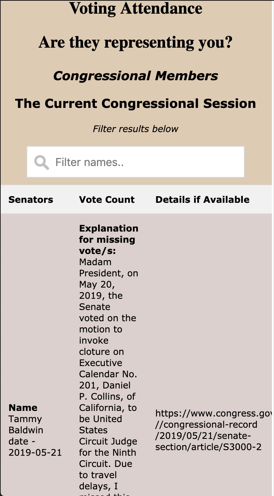
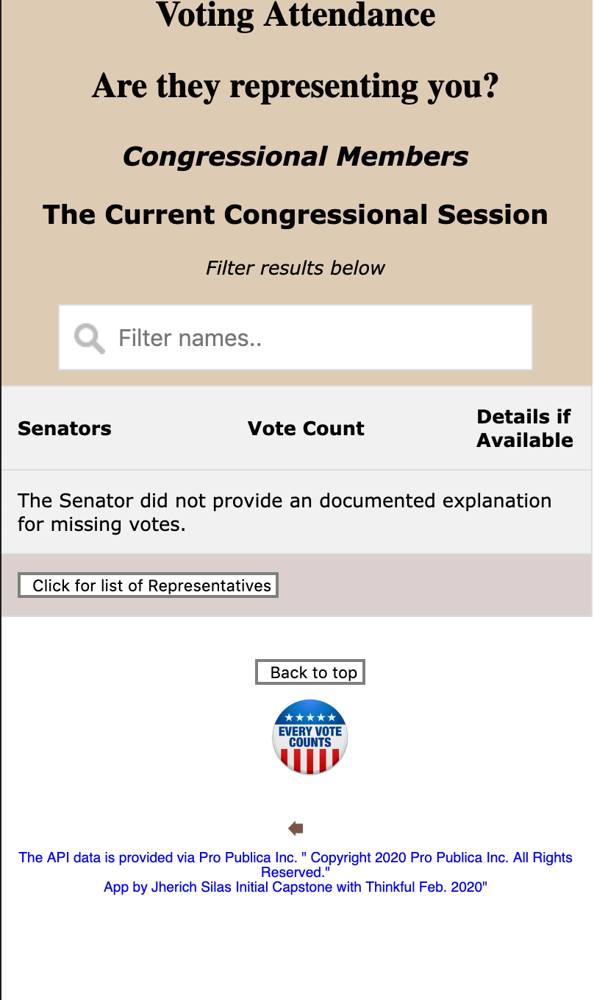

# YourReps

YourReps is a application that allows you to see how and if your Senators are voting. 

## Motivation

After talking to friends I wondered who many of our Senators were actually representing us. So I built this application to see how often they did their elected duty.

## Screenshots

The index loads and shows an image of Congress, and the entry link for the application. The long term idea for this app is that it will show both hosues.  And so it uses the term represenatives as a nod to our form of goverment rather than a specific title for the House or Senate. 

This view shows the list of Seantors, and just above it is the filter you can you select a specific member.

This screen shows details when available in the API.  - An exmaple is Senator Tammy Baldwin.

In some cases the API did not show vote details even for well known Seantors.  I looked at this with one of my Mentors and we double checked the API, unfortunately that data was not available.   - An exmaple is Senator Bernard Sanders.

Once you're done reviewing details, or if details aren't available.  Click the "Click for list of Senators Button"

## Summary

The application was built to allow anyone to quickly see a list of their Senators and decide if they belived by their record that they were doing their elected job.

## Built With

### Front-End

* HTML
* JSS
* JavaScript

## Demo

[Live Demo](https://jjsilas.github.io/your_reps/)

## Author

* **Jherich Silas** - ** - Front-End development/testing, styling

## Acknowledgments

* **Mario Mol** - ** - My Mentor through this project
