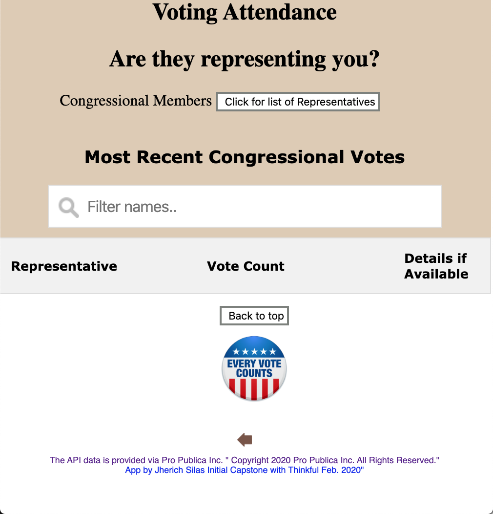

# YourReps

YourReps is a application that allows you to see how and if your elected Represenatives are voting. 

## Motivation

After talking to friends I wondered who many of your elected represenatives were actually representing us. So I built this application to see how often they did their elected duty.

## Screenshots

The index load load and shows an image of the House of Represenatitives, and the entry link for the application.

This image shows the first view after you enter the app.  You will see the button pull the list of represenatives.

This view shows the list of Represenatives, and just above it is the filter you can you select a specific member.

Finally the app shows the details available in the API about their voting record.

## Summary

The application was built to allow anyone to quickly see a list of their Represenativies and decide if they belived by their record that they were doing their elected job.

## Built With

### Front-End

* HTML
* JSS
* JavaScript

## Demo

[Live Demo](https://jjsilas.github.io/your_reps/)

## Author

* **Jherich Silas** - ** - Front-End development/testing, styling

## Acknowledgments

* **Mario Mol** - ** - My Mentor through this project
